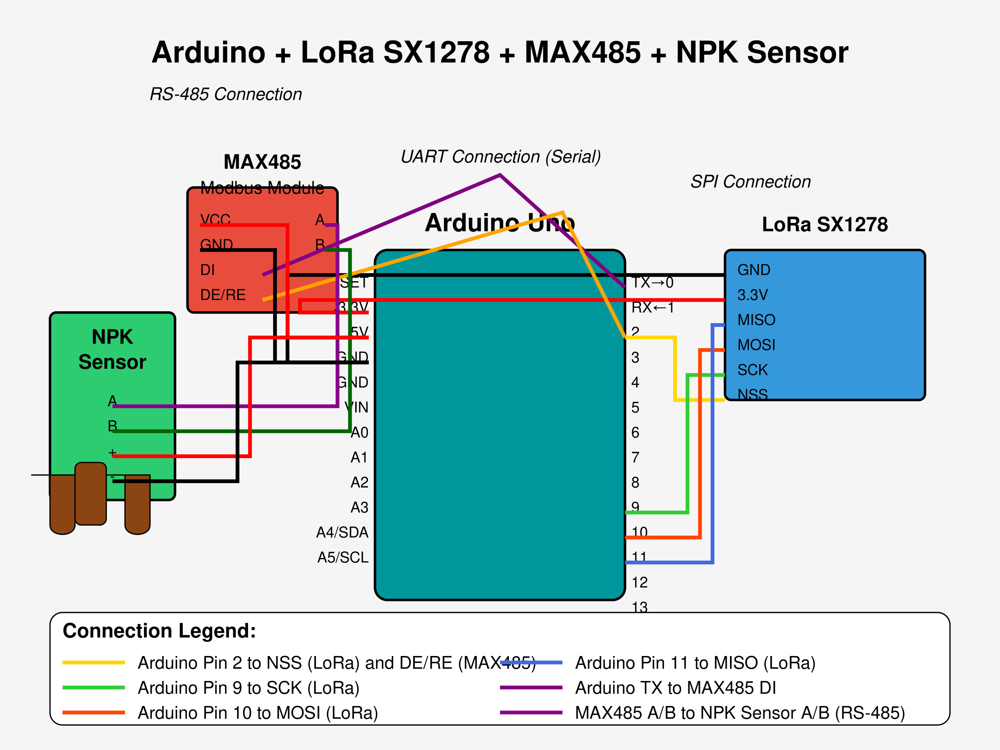
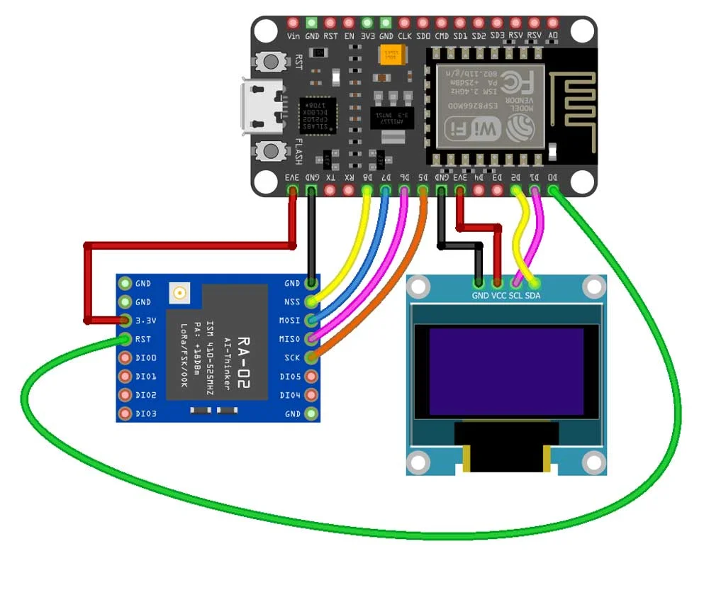

# LoRa-Based IoT Smart Fertigation System with Arduino Nano, LoRa WAN, ESP8266 & Blynk 2.0

## Overview
In areas lacking Wi-Fi coverage, traditional IoT solutions face limitations. This project addresses such challenges by employing LoRa technology for long-range communication between field sensors and a central hub. It demonstrates the development of a LoRa-based IoT Smart Agriculture Monitoring and Automatic Fertigation System using JXCT Soil NPK Sensor with Modbus RS485, Arduino Nano, LoRa SX1278 Tranmitter and Receiver and the Blynk IoT 2.0 platform. The system monitors soil nutrients, and automates fertigation based on real-time data.

## Components Required

The system consists of:

### Sensor Node (Transmitter): 
Utilizes Arduino Nano, Modbus RS485 and SX1278 LoRa module to collect data from soil NPK sensor. It also controls a nutrient rich-water pump via a relay for automated irrigation.

### Gateway Node (Receiver): 
Employs NodeMCU ESP8266 and SX1278 LoRa module to receive data from the sensor node. The ESP8266 uploads this data to the Blynk IoT cloud platform, enabling remote monitoring and control.

### Miscellaneous Hardware Required
5V Single Channel Relay Module\
5V DC Water Pump\
0.96" SSD1306 I2C OLED Display\
Breadboard, jumper wires, power supply\

## Circuit Diagrams
### Transmitter Circuit

### Receiver Circuit

## Blynk 2.0 IoT Cloud Setup
Blynk 2.0 IoT Cloud Setup
Create a New Template:

Log in to Blynk.cloud and create a new template named "Smart Agro".
Select the hardware (ESP8266) and connection type (Wi-Fi).
Define Datastreams:

Add datastreams for Nitrogen,Phosphorus and Potassium.
Set Up Events:

Configure events to receive notifications for specific conditions, such as low soil moisture.
Design Web Dashboard:

Add widgets (e.g., gauges, charts) to visualize sensor data in real-time.
## Blynk Mobile Application Setup
Create a New Project:

In the Blynk mobile app, create a project linked to the "Smart Agro" template.
Add Widgets:

Include widgets corresponding to the datastreams, such as gauges for soil moisture and temperature.
Configure Notifications:

Set up alerts to notify users of critical events, like when soil moisture drops below a threshold.

